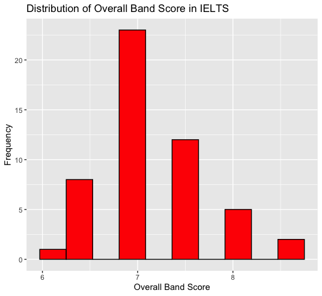

```{r setup, include=FALSE}
knitr::opts_chunk$set(cache = FALSE, echo = TRUE, message = FALSE, warning = FALSE)
```

<!-- ======================================================================= -->

<!-- ============================== FOOTNOTES ============================== -->

<!-- ======================================================================= -->

21080647, [Github Repo](https://github.com/Gandil312740/Midterm.git)

**Research Question**

What is the current state of validity of the International English Language Testing System (IELTS) and what are the recent developments and critical perspectives regarding its use as a language proficiency test?

# Introduction

IELTS is widely recognized and accepted by academic institutions, employers, and governments around the world. In this report, we analyze a dataset consisting of responses from 51 friends of mine who have taken the IELTS exam. The purpose of this analysis is to explore patterns and trends in the dataset, as well as to gain insights into the factors that may affect an individual's performance on the IELTS exam. The dataset includes information on their personal details, such as:

-   **Name & Surname:** The name and surname of examiners.
-   **Date of birth:** The examiner's date of birth.
-   **Sex:** The examiner's gender.
-   **Nationality:** The examiner's nationality.
-   **Age, when you took the exam:** Age of the examiner when s/he took the exam.
-   **Reading score:** The examiner's score for the reading section of the IELTS exam.
-   **Listening score:** The examiner's score for the listening section of the IELTS exam.
-   **Speaking score:** The examiner's score for the speaking section of the IELTS exam.
-   **Writing score:** The examiner's score for the writing section of the IELTS exam.
-   **Overall band score:** The examiner's overall band score for the IELTS exam.
-   **CEFR level:** The examiner's Common European Framework of Reference (CEFR) level for English language proficiency
-   **Whether the exam was useful when they applied to an academic institution or a job:** whether the examiner found the IELTS exam useful when applying to an academic institution or a job.

The International English Language Testing System (IELTS) is a standardized test used to evaluate the English language proficiency of non-native English speakers. It is available in two formats: Academic and General Training. The test is scored on a scale of 0 to 9, with 0 indicating no proficiency and 9 indicating native-like proficiency. There are over 1,100 IELTS test centers in more than 140 countries worldwide, and the test is recognized by over 10,000 organizations globally. Recent developments in IELTS include computer-delivered IELTS, IELTS Indicator, IELTS for UK Visas and Immigration (UKVI), changes to test content, and increased availability of preparation materials.The IELTS test has been criticized for its cultural bias, inaccurate assessment of language ability, high-stakes nature, lack of transparency, and profit-driven enterprise. Critics argue that the test is culturally biased and does not account for the diversity of English language users. It is often used as a high-stakes assessment, leading to anxiety and stress. Research has shown that the IELTS test is a reliable predictor of academic success for non-native English speakers studying in an English as a medium of instruction environment. A study conducted by Liu and colleagues (2019) found that IELTS scores were positively correlated with academic performance for Chinese international students studying in a UK university. Shrestha and colleagues (2019) found that IELTS scores were a good predictor of academic success for Nepalese students studying in a UK university. However, the predictive validity of the test may vary depending on factors such as the academic program and institution, the individual test-taker's background and experience, and the specific demands of the academic environment.

{width="300"}

## Literature Review

new citation for my article @Schoepp2018 or I can type [@Schoepp2018]

new citation for my article @OSullivan2018 or I can type [@OSullivan2018]

new citation for my article @Charge1997 or I can type [@Charge1997]

new citation for my article @Pearson2019 or I can type [@Pearson2019]

\newpage

# References {#references}

::: {#refs}
:::
